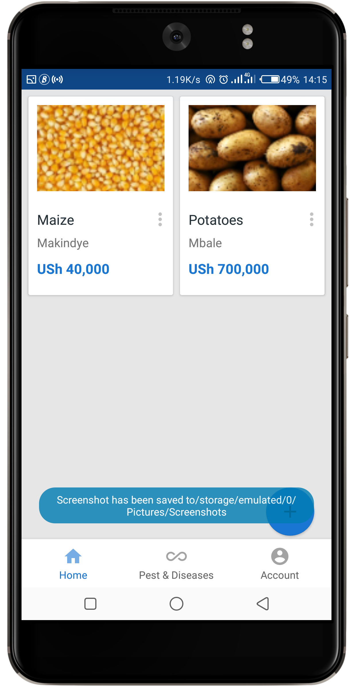
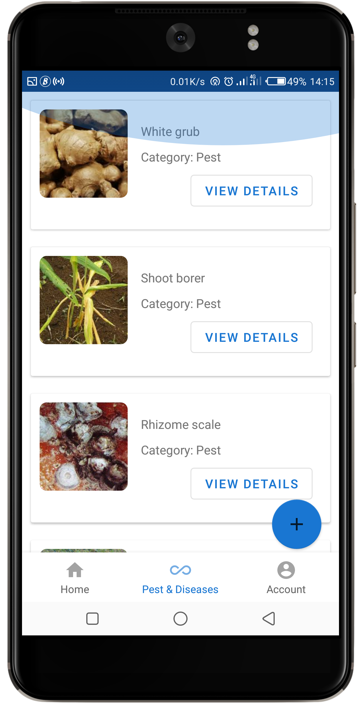
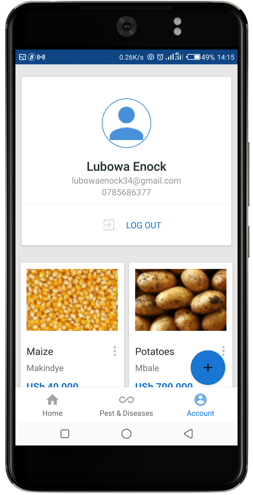

# Agric product listing app
An Android that allows farmers list their products for sale.

Android core implementations:
<ul>
  <li>CardView</li>
  <li>Bottom Navigation menu</li>
  <li>RecyclerView</li>
</ul>

External services:
<ul>
  <li>Firebase database</li>
  <li>Firebase Auth</li>
  <li>Firebase storage</li>
  <li>Picasso image library</li>
</ul>

<h3>Demo</h3>

